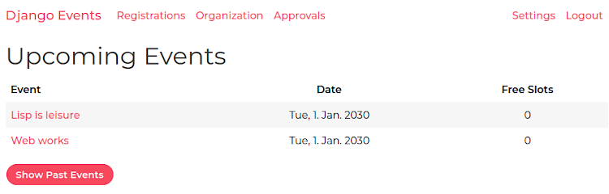
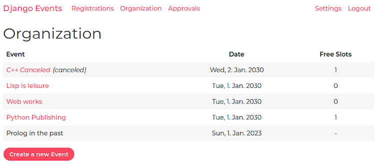
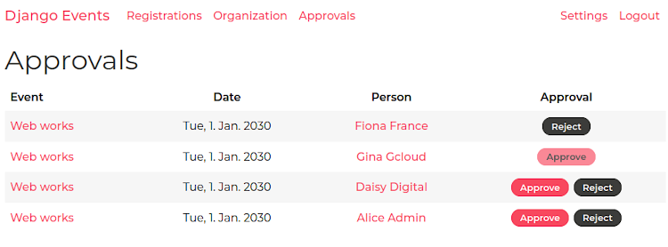

# Django Event Management

This repository is a proof of concept of a learning project.  
It is an edited and anonymized version to provide a public release.

This event management system is a proof of concept of a learning project.  
It basically lists upcoming and past events.

Each event has basic properties like title, description (using Markdown), date, duration and maximum of participants. Additionally, users can specify if an event has been published (or is just a draft), if it was canceled and if it will be in leisure time.

Events in working time have to be approved from superiors or their representatives. Working time events come along with related project numbers for later accounting.

## Documentation

- Take a look into the  [documentation](docs/README.md), which also describes how to use [Docker](docs/docker.md) for installation.

## Installation

- Requirements: [Python](https://www.python.org/) (recommended version 3.11) and [pip](https://pip.pypa.io/) (recommended version 23.2.1)
- Install the required packages:  
  `python -m pip install -r requirements_dev.txt`
- To initially apply migrations (creating the database and add some data), run:  
  `python manage.py migrate`
- Now you have multiple options to create at least one superuser.  
  Superusers have access to an administration area and can create additional users.
  1. **Import example data** (This has to be the first step, as it uses predefined IDs):  
  `python manage.py loaddata events/fixtures/examples/0001_user.xml events/fixtures/examples/0002_person.xml events/fixtures/examples/0003_event.xml events/fixtures/examples/0004_registration.xml`  
  The superuser is `aadmin` with the password `django`.  
  [Read more about importing data](docs/example-data.md#import-data)
  2. **Generate example data**:  
  `python manage.py populate`  
  The superuser and password will be displayed. If this command is run first, the superuser is `dteamson1` with password `django`.  
  [Read more about generating data](docs/example-data.md#generate-data)
  3. **Create a new superuser**:  
  `python manage.py createsuperuser --username admin --email admin@example.org`  
  You will be prompted to enter a password. You can also use a different username and email.
- To start the development web server at [127.0.0.1:8000](http://127.0.0.1:8000/):  
  `python manage.py runserver 8000`

## Screenshots

