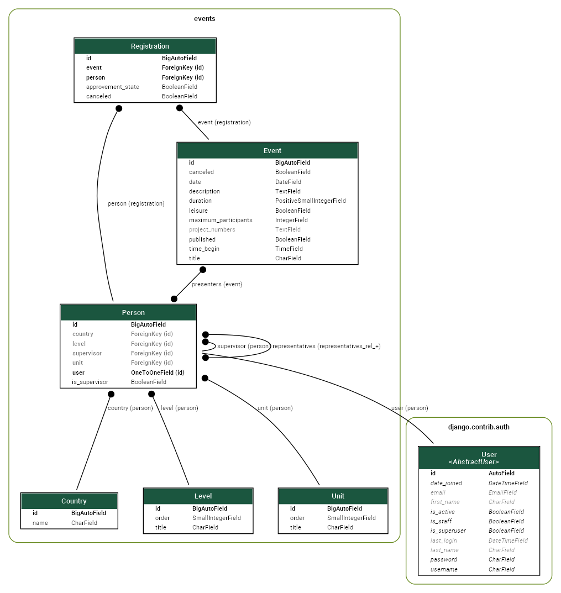

# Graphs - Documentation - Django Event Management

## Create a (Graphviz) dot file with django-extensions

- Install [django-extensions](https://github.com/django-extensions/django-extensions):
  - `pip install django-extensions`
  - Add `django_extensions` to section `INSTALLED_APPS` in file `settings.py`:  
    `INSTALLED_APPS = ( [...]`  
    `.   'django_extensions',`  
    `[...] )`  
- Generate a dot file by the [graph_models](https://django-extensions.readthedocs.io/en/latest/graph_models.html) command:  
  `python manage.py graph_models -a > events.dot`
- To add specific models, use e.g.:  
  `python manage.py graph_models events -a -I User,Person,Event,Registration,Country,Level,Unit > events-user.dot`
  - Note: To get a list of available models, run:
    `python manage.py shell`  
    `import django.apps`  
    `for m in django.apps.apps.get_models():`  
    `.   print(m.__name__)`
- Directly create an image (with grouped models):
  - `pip install pyparsing pydot`
  - `python manage.py graph_models events -a -I User,Person,Event,Registration,Country,Level,Unit -g -o events.png`
  - Note: This uses Graphviz, see below

## Create an image using Graphviz

- Install [Graphviz](https://graphviz.org/download/)
- Create a PNG file using Graphviz:  
  `dot -Tpng -o events.png events.dot`
- Note: If you get a syntax error, copy-paste the file contents to a new file ([source](https://forum.graphviz.org/t/syntax-error-in-line-1/1236/3))
- Note: If you get an error like "Couldn't load font Roboto":
  - Use the "Download family" link at [Google Fonts](https://fonts.google.com/specimen/Roboto)
  - Install the fonts in "Settings" -> "Fonts" (Windows 10)
- Result: 

## Miscellaneous

- Converting dot to gml produced a bad result  
  (`gv2gml events.dot > events.gml`)  
  That could be imported in [yEd](https://www.yworks.com/products/yed/download#download)
- Good links: <https://stackoverflow.com/a/6777376>
